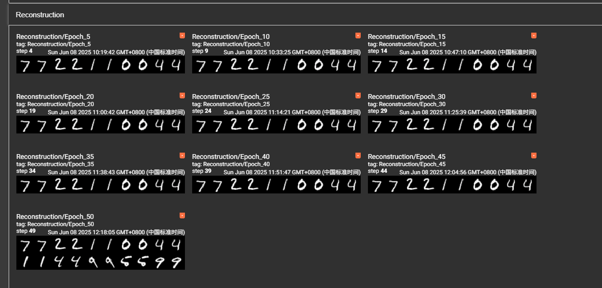
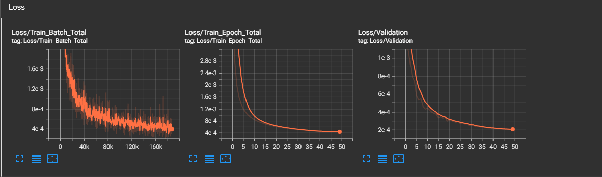
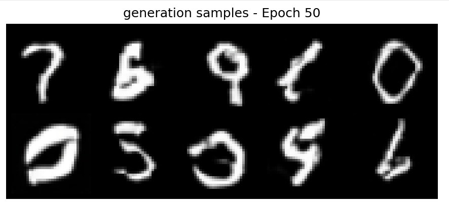
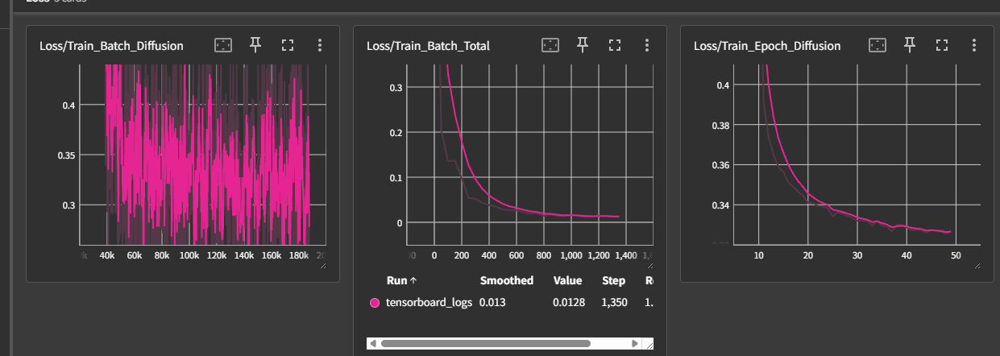

# Stable Diffusion for MNIST

一个基于Stable Diffusion架构的MNIST数字生成模型，支持多种训练模式和Classifier Guidance。

## 项目概述

本项目实现了一个专门针对MNIST数据集优化的Stable Diffusion模型，包含以下核心功能：

- **VAE (Variational AutoEncoder)**: 图像编码解码
- **UNet扩散模型**: 噪声预测和去噪
- **分类器指导**: 条件生成控制
- **多种训练模式**: reconstruction、diffusion、classifier、joint
- **完整的训练和评估流程**

## 项目架构

```
stablediffusion/
├── stablediffusion.py     # 主模型定义
├── VAE.py                # VAE编码器和解码器
├── unet.py               # UNet扩散模型
├── diffusion.py          # 扩散过程实现
├── dataprocess.py        # MNIST数据处理
└── train_eval.py         # 训练和评估脚本
```

### 核心组件

#### 1. Stable Diffusion模型 (`stablediffusion.py`)

- **主类**: `stablediffusion`
- **分类器**: `LatentClassifier`
- **工厂函数**: `stable_diffusion_for_minist()`

#### 2. VAE模块 (`VAE.py`)

- **编码器**: `VAE_Encoder` - 将图像编码到潜在空间
- **解码器**: `VAE_Decoder` - 从潜在空间重建图像
- **注意力机制**: `VAE_AttentionBlock`
- **残差块**: `VAE_ResidualBlock`

#### 3. 扩散模型 (`diffusion.py`)

- **扩散过程**: `DiffusionModel`
- **UNet创建**: `create_unet()`
- **EMA更新**: 指数移动平均权重

#### 4. UNet网络 (`unet.py`)

- **主网络**: `UNet`
- **残差块**: `ResidualBlock`
- **注意力**: `AttentionBlock`
- **上下采样**: `Upsample`, `Downsample`

## 模型规格


| 组件         | 配置            |
| ------------ | --------------- |
| 输入尺寸     | 32×32×3 (RGB) |
| 潜在空间     | 8×8×2         |
| 下采样倍数   | 4×             |
| UNet基础通道 | 32              |
| 时间步数     | 1000            |
| 类别数       | 10 (0-9数字)    |

## 快速开始

### 环境要求

```bash
torch>=1.9.0
torchvision>=0.10.0
matplotlib
tqdm
tensorboard
numpy
```

### 基本使用

```python
from stablediffusion.stablediffusion import stable_diffusion_for_minist
from stablediffusion.dataprocess import MNISTDataset

# 创建模型
model = stable_diffusion_for_minist(use_classifier_guidance=True)

# 创建数据集
dataset = MNISTDataset(
    root_dir="./data",
    image_size=32,
    batch_size=16,
    convert_to_rgb=True
)

# 生成样本
with torch.no_grad():
    latent_samples = model.sample_latent(batch_size=4, device='cuda')
    generated_images = model.decoder(latent_samples[-1])
```

## 训练模式

### 1. Reconstruction模式

训练VAE重建能力，学习有效的图像表示。

```python
loss = F.mse_loss(reconstructed, original)
```

### 2. Diffusion模式

训练扩散模型，学习在潜在空间中生成。

```python
loss = diffusion_model(latent, labels)
```

### 3. Classifier模式

训练潜在空间分类器，用于条件生成。

```python
loss = F.cross_entropy(classifier_logits, labels)
```

### 4. Joint模式

同时训练扩散模型和分类器。

```python
total_loss = diffusion_loss + classifier_weight * classifier_loss
```

## 训练脚本

### 运行训练

```bash
python stablediffusion/train_eval.py
```

### 主要配置参数


| 参数                      | 默认值  | 说明           |
| ------------------------- | ------- | -------------- |
| `batch_size`              | 16      | 批大小         |
| `epochs`                  | 50      | 训练轮次       |
| `learning_rate`           | 1e-4    | 学习率         |
| `classifier_weight`       | 1.0     | 分类器损失权重 |
| `training_mode`           | 'joint' | 训练模式       |
| `use_classifier_guidance` | True    | 启用分类器指导 |

### 训练流程

1. **数据加载**: 自动下载和预处理MNIST
2. **模型初始化**: 创建所有组件
3. **训练循环**: 多模式训练支持
4. **定期评估**: 损失和准确率监控
5. **样本生成**: 可视化训练进度
6. **模型保存**: 最佳模型和检查点

## 📈 监控和可视化

### TensorBoard日志

- 训练/验证损失
- 分类准确率
- 学习率变化
- 生成样本
- 重建对比

### 输出文件

```
/root/tf-logs/
├── tensorboard_logs/     # TensorBoard日志
├── samples/             # 生成样本
├── reconstructions/     # 重建对比
├── classifier_guided_samples/  # 分类器指导样本
├── best_model.pt       # 最佳模型
└── checkpoint_epoch_*.pt  # 训练检查点
```

## 实验设置

### 建议的训练顺序

1. **Reconstruction (5-10 epochs)**: 预训练VAE
2. **Diffusion (20-30 epochs)**: 训练扩散模型
3. **Joint (10-20 epochs)**: 联合优化

### 超参数调优

- `learning_rate`: [1e-5, 1e-3]
- `classifier_weight`: [0.1, 2.0]
- `guidance_scale`: [1.0, 10.0]
- `ema_decay`: [0.995, 0.9999]

## output

### reconstruction





### diffusion






### reference

```##

- [Stable Diffusion原论文](https://arxiv.org/abs/2112.10752)
- [DDPM论文](https://arxiv.org/abs/2006.11239)
- [Classifier Guidance](https://arxiv.org/abs/2105.05233)
```
